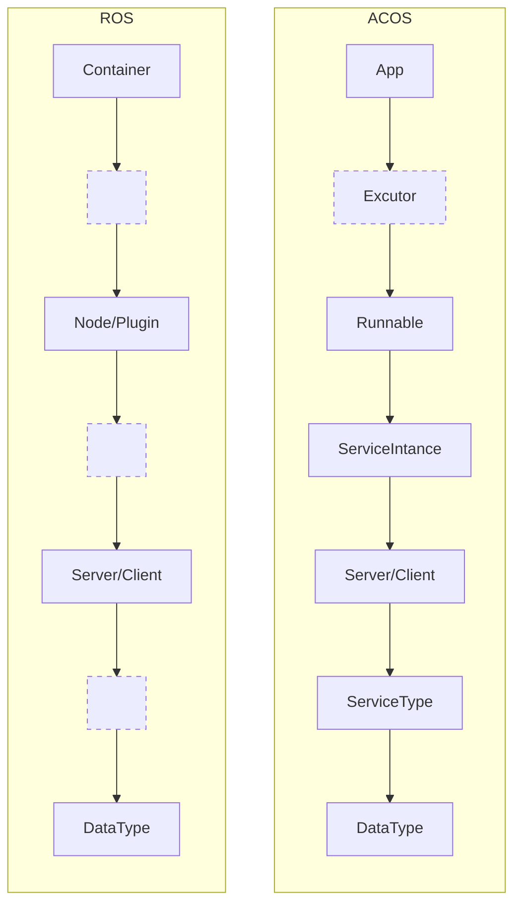
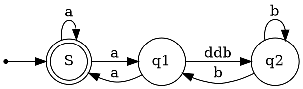

## porting workflow

| Node | Subscribers | Publishers |
|:-----|:------------|:-----------|
| /aggregator_node | /diagnostics /parameter_events | /diagnostics_agg /diagnostics_toplevel_state /parameter_events /rosout |
| /autoware_api/external/autoware_iv_adaptor | /parameter_events | /rosout |
| /autoware_api/external/cpu_usage | /parameter_events /system/system_monitor/cpu_monitor/cpu_usage | /api/external/get/cpu_usage /parameter_events /rosout |
| /autoware_api/external/diagnostics | /parameter_events | /api/external/get/diagnostics /parameter_events /rosout |
| /autoware_api/external/door | /parameter_events /vehicle/status/door_status | /api/external/get/door /parameter_events /rosout |
| /autoware_api/external/emergency | /api/autoware/get/emergency /parameter_events | /api/external/get/emergency /parameter_events /rosout |
| /autoware_api/external/engage | /api/autoware/get/engage /autoware/state /parameter_events | /api/external/get/engage /parameter_events /rosout |
| /autoware_api/external/fail_safe_state | /parameter_events /system/fail_safe/mrm_state | /api/external/get/fail_safe/state /parameter_events /rosout |
| /autoware_api/external/initial_pose | /parameter_events | /parameter_events /rosout /service_log |
| /autoware_api/external/map | /api/autoware/get/map/info/hash /parameter_events | /api/external/get/map/info/hash /parameter_events /rosout |
| /autoware_api/external/metadata_packages | /parameter_events | /parameter_events /rosout |
| /autoware_api/external/operator | /api/autoware/get/observer /api/autoware/get/operator /parameter_events | /api/external/get/observer /api/external/get/operator /parameter_events /rosout |
| /autoware_api/external/route | /api/routing/route /parameter_events | /api/external/get/route /parameter_events /rosout /service_log |
| /autoware_api/external/rtc_controller | /parameter_events /planning/cooperate_status/avoidance_left /planning/cooperate_status/avoidance_right /planning/cooperate_status/blind_spot /planning/cooperate_status/crosswalk /planning/cooperate_status/detection_area /planning/cooperate_status/intersection /planning/cooperate_status/lane_change_left /planning/cooperate_status/lane_change_right /planning/cooperate_status/no_stopping_area /planning/cooperate_status/occlusion_spot /planning/cooperate_status/pull_out /planning/cooperate_status/pull_over /planning/cooperate_status/traffic_light /planning/cooperate_status/virtual_traffic_light | /api/external/get/rtc_status /parameter_events /rosout |
| /autoware_api/external/service | /parameter_events | /api/external/get/service /parameter_events /rosout |
| /autoware_api/external/start | /api/external/get/operator /parameter_events | /parameter_events /rosout |
| /autoware_api/external/vehicle_status | /control/command/control_cmd /parameter_events /vehicle/status/gear_status /vehicle/status/hazard_lights_status /vehicle/status/steering_status /vehicle/status/turn_indicators_status /vehicle/status/velocity_status | /api/external/get/command/selected/vehicle /api/external/get/vehicle/status /parameter_events /rosout |
| /autoware_api/external/velocity | /parameter_events | /parameter_events /rosout |
| /autoware_api/external/version | /parameter_events | /parameter_events /rosout |
| /autoware_api/internal/autoware_iv_adaptor | /parameter_events | /rosout |
| /autoware_api/internal/crosswalk_states | /parameter_events | /parameter_events /rosout |
| /autoware_api/internal/intersection_states | /parameter_events | /parameter_events /rosout |
| /autoware_api/internal/iv_msgs | /autoware/state /parameter_events /perception/object_recognition/tracking/objects /planning/scenario_planning/trajectory /system/fail_safe/mrm_state /vehicle/status/control_mode | /api/iv_msgs/autoware/state /api/iv_msgs/perception/object_recognition/tracking/objects /api/iv_msgs/planning/scenario_planning/trajectory /api/iv_msgs/vehicle/status/control_mode /parameter_events /rosout |
| /autoware_api/internal/operator | /api/autoware/get/emergency /control/current_gate_mode /control/external_cmd_selector/current_selector_mode /parameter_events /vehicle/status/control_mode | /api/autoware/get/observer /api/autoware/get/operator /control/gate_mode_cmd /parameter_events /rosout |
| /autoware_api/internal/traffic_signals | /parameter_events | /parameter_events /rosout |
| /autoware_api/internal/velocity | /parameter_events /planning/scenario_planning/current_max_velocity | /api/autoware/get/velocity_limit /parameter_events /planning/scenario_planning/max_velocity_default /rosout |
| /awapi/autoware_engage_relay | /parameter_events | /parameter_events /rosout |
| /awapi/awapi_awiv_adapter_node | /api/iv_msgs/autoware/state /awapi/vehicle/put/stop /awapi/vehicle/put/velocity /control/command/control_cmd /control/current_gate_mode /diagnostics_agg /localization/kinematic_state /parameter_events /planning/scenario_planning/current_max_velocity /planning/scenario_planning/lane_driving/lane_change_available /planning/scenario_planning/lane_driving/lane_change_candidate_path /planning/scenario_planning/lane_driving/lane_change_ready /planning/scenario_planning/lane_driving/obstacle_avoidance_candidate_trajectory /planning/scenario_planning/lane_driving/obstacle_avoidance_ready /planning/scenario_planning/status/infrastructure_commands /planning/scenario_planning/status/stop_reasons /planning/scenario_planning/trajectory /sensing/gnss/ublox/nav_sat_fix /system/emergency/hazard_status /system/fail_safe/mrm_state /system/v2x/virtual_traffic_light_states /vehicle/status/battery_charge /vehicle/status/control_mode /vehicle/status/gear_status /vehicle/status/hazard_lights_status /vehicle/status/steering_status /vehicle/status/turn_indicators_status | /awapi/autoware/get/status /awapi/lane_change/get/status /awapi/object_avoidance/get/status /awapi/tmp/infrastructure_commands /awapi/tmp/virtual_traffic_light_states /awapi/vehicle/get/status /parameter_events /planning/scenario_planning/max_velocity_default /rosout |
| /awapi/awapi_relay_container | /parameter_events | /rosout |
| /awapi/crosswalk_status_relay | /parameter_events | /parameter_events /rosout |
| /awapi/expand_stop_range_relay | /parameter_events | /parameter_events /rosout |
| /awapi/external_approval_relay | /parameter_events | /parameter_events /rosout |
| /awapi/force_approval_relay | /parameter_events | /parameter_events /rosout |
| /awapi/force_available_relay | /parameter_events | /parameter_events /rosout |
| /awapi/force_lane_change_relay | /parameter_events | /parameter_events /rosout |
| /awapi/intersection_status_relay | /parameter_events | /parameter_events /rosout |
| /awapi/lane_change_approval_relay | /parameter_events | /parameter_events /rosout |
| /awapi/nearest_traffic_signal_relay | /parameter_events /planning/scenario_planning/lane_driving/behavior_planning/debug/traffic_signal | /awapi/traffic_light/get/nearest_traffic_signal /parameter_events /rosout |
| /awapi/obstacle_avoid_approval_relay | /parameter_events | /parameter_events /rosout |
| /awapi/overwrite_traffic_signals_relay | /parameter_events | /parameter_events /rosout |
| /awapi/pose_initialization_request_relay | /parameter_events | /parameter_events /rosout |
| /awapi/predict_object_relay | /parameter_events /perception/object_recognition/objects | /awapi/prediction/get/objects /parameter_events /rosout |
| /awapi/put_goal_relay | /parameter_events | /parameter_events /rosout |
| /awapi/put_route_relay | /parameter_events | /parameter_events /rosout |
| /awapi/ready_module_relay | /parameter_events | /parameter_events /rosout |
| /awapi/route_relay | /parameter_events /planning/mission_planning/route | /awapi/autoware/get/route /parameter_events /rosout |
| /awapi/running_modules_relay | /parameter_events | /parameter_events /rosout |
| /awapi/speed_exceeded_relay | /parameter_events /planning/scenario_planning/motion_velocity_smoother/stop_speed_exceeded | /awapi/autoware/get/stop_speed_exceeded /parameter_events /rosout |
| /awapi/traffic_signal_relay | /parameter_events | /parameter_events /rosout |
| /awapi/transform_listener_impl_56a5bfd08da8 | /parameter_events /tf /tf_static | /rosout |
| /awapi/vehicle_engage_relay | /parameter_events | /parameter_events /rosout |
| /control/control_container | /parameter_events | /rosout |
| /control/external_cmd_converter | /control/current_gate_mode /external/selected/external_control_cmd /external/selected/gear_cmd /external/selected/heartbeat /localization/kinematic_state /parameter_events | /api/external/get/command/selected/control /diagnostics /external/selected/control_cmd /parameter_events /rosout |
| /control/external_cmd_selector | /api/external/set/command/local/control /api/external/set/command/local/heartbeat /api/external/set/command/local/shift /api/external/set/command/local/turn_signal /api/external/set/command/remote/control /api/external/set/command/remote/heartbeat /api/external/set/command/remote/shift /api/external/set/command/remote/turn_signal /parameter_events | /control/external_cmd_selector/current_selector_mode /diagnostics /external/selected/external_control_cmd /external/selected/gear_cmd /external/selected/hazard_lights_cmd /external/selected/heartbeat /external/selected/turn_indicators_cmd /parameter_events /rosout |
| /control/operation_mode_transition_manager | /api/autoware/get/engage /control/command/control_cmd /control/current_gate_mode /control/external_cmd_selector/current_selector_mode /control/vehicle_cmd_gate/operation_mode /localization/kinematic_state /parameter_events /planning/scenario_planning/trajectory /vehicle/status/control_mode | /autoware/engage /control/gate_mode_cmd /control/operation_mode_transition_manager/debug_info /parameter_events /rosout /service_log /system/operation_mode/state |
| /control/shift_decider | /autoware/state /control/trajectory_follower/control_cmd /parameter_events | /control/shift_decider/gear_cmd /parameter_events /rosout |
| /control/trajectory_follower/controller_node_exe | /localization/acceleration /localization/kinematic_state /parameter_events /planning/scenario_planning/trajectory /vehicle/status/steering_status | /control/trajectory_follower/control_cmd /control/trajectory_follower/lateral/diagnostic /control/trajectory_follower/lateral/predicted_trajectory /control/trajectory_follower/longitudinal/diagnostic /control/trajectory_follower/longitudinal/slope_angle /diagnostics /parameter_events /rosout |
| /control/trajectory_follower/lane_departure_checker_node | /control/trajectory_follower/lateral/predicted_trajectory /localization/kinematic_state /map/vector_map /parameter_events /planning/mission_planning/route /planning/scenario_planning/trajectory | /control/trajectory_follower/lane_departure_checker_node/debug/deviation/lateral /control/trajectory_follower/lane_departure_checker_node/debug/deviation/yaw /control/trajectory_follower/lane_departure_checker_node/debug/deviation/yaw_deg /control/trajectory_follower/lane_departure_checker_node/debug/marker_array /control/trajectory_follower/lane_departure_checker_node/debug/processing_time_ms /diagnostics /parameter_events /rosout |
| /control/transform_listener_impl_5fb47c244120 | /parameter_events /tf /tf_static | /rosout |
| /control/vehicle_cmd_gate | /autoware/engage /control/gate_mode_cmd /control/shift_decider/gear_cmd /control/trajectory_follower/control_cmd /external/selected/control_cmd /external/selected/gear_cmd /external/selected/hazard_lights_cmd /external/selected/heartbeat /external/selected/turn_indicators_cmd /parameter_events /planning/hazard_lights_cmd /planning/turn_indicators_cmd /system/emergency/control_cmd /system/emergency/gear_cmd /system/emergency/hazard_lights_cmd /system/fail_safe/mrm_state /system/operation_mode/state /vehicle/status/steering_status | /api/autoware/get/emergency /api/autoware/get/engage /control/command/control_cmd /control/command/emergency_cmd /control/command/gear_cmd /control/command/hazard_lights_cmd /control/command/turn_indicators_cmd /control/current_gate_mode /control/vehicle_cmd_gate/is_paused /control/vehicle_cmd_gate/is_start_requested /control/vehicle_cmd_gate/operation_mode /diagnostics /parameter_events /rosout /service_log |
| /default_ad_api/container | /parameter_events | /rosout |
| /default_ad_api/helpers/initial_pose_adaptor | /initialpose /parameter_events | /parameter_events /rosout /service_log |
| /default_ad_api/helpers/routing_adaptor | /api/routing/state /parameter_events /planning/mission_planning/checkpoint /planning/mission_planning/goal | /parameter_events /rosout /service_log |
| /default_ad_api/node/autoware_state | /api/localization/initialization_state /api/operation_mode/state /api/routing/state /parameter_events /system/component_state_monitor/component/launch/control /system/component_state_monitor/component/launch/localization /system/component_state_monitor/component/launch/map /system/component_state_monitor/component/launch/perception /system/component_state_monitor/component/launch/planning /system/component_state_monitor/component/launch/sensing /system/component_state_monitor/component/launch/system /system/component_state_monitor/component/launch/vehicle | /autoware/state /parameter_events /rosout |
| /default_ad_api/node/fail_safe | /parameter_events /system/fail_safe/mrm_state | /api/fail_safe/mrm_state /parameter_events /rosout |
| /default_ad_api/node/interface | /parameter_events | /parameter_events /rosout /service_log |
| /default_ad_api/node/localization | /localization/initialization_state /parameter_events | /api/localization/initialization_state /parameter_events /rosout /service_log |
| /default_ad_api/node/motion | /control/vehicle_cmd_gate/is_paused /control/vehicle_cmd_gate/is_start_requested /localization/kinematic_state /parameter_events | /api/motion/state /parameter_events /rosout /service_log |
| /default_ad_api/node/operation_mode | /parameter_events /system/component_state_monitor/component/autonomous/control /system/component_state_monitor/component/autonomous/localization /system/component_state_monitor/component/autonomous/map /system/component_state_monitor/component/autonomous/perception /system/component_state_monitor/component/autonomous/planning /system/component_state_monitor/component/autonomous/sensing /system/component_state_monitor/component/autonomous/system /system/component_state_monitor/component/autonomous/vehicle /system/operation_mode/state | /api/operation_mode/state /parameter_events /rosout /service_log |
| /default_ad_api/node/routing | /parameter_events /planning/mission_planning/route /planning/mission_planning/route_state /system/operation_mode/state | /api/routing/route /api/routing/state /parameter_events /rosout /service_log |
| /launch_ros_34239 |  | /parameter_events /rosout |
| /map/lanelet2_map_loader | /parameter_events | /map/vector_map /parameter_events /rosout |
| /map/lanelet2_map_visualization | /map/vector_map /parameter_events | /map/vector_map_marker /parameter_events /rosout |
| /map/map_container | /parameter_events | /rosout |
| /map/map_hash_generator |  | /api/autoware/get/map/info/hash /parameter_events /rosout |
| /map/pointcloud_map_loader | /parameter_events | /map/pointcloud_map /parameter_events /rosout |
| /map/vector_map_tf_generator | /map/vector_map /parameter_events | /parameter_events /rosout /tf_static |
| /map_height_fitter | /map/pointcloud_map /parameter_events | /parameter_events /rosout |
| /occupancy_grid_map/occupancy_grid_map_container | /parameter_events | /rosout |
| /occupancy_grid_map/occupancy_grid_map_node | /occupancy_grid_map/concatenated/pointcloud /occupancy_grid_map/virtual_scan/laserscan /parameter_events /perception/obstacle_segmentation/pointcloud | /parameter_events /perception/occupancy_grid_map/map /rosout |
| /occupancy_grid_map/pointcloud_to_laserscan_node | /parameter_events /perception/obstacle_segmentation/pointcloud | /occupancy_grid_map/virtual_scan/laserscan /occupancy_grid_map/virtual_scan/pointcloud /occupancy_grid_map/virtual_scan/ray /occupancy_grid_map/virtual_scan/stixel /parameter_events /rosout |
| /occupancy_grid_map/transform_listener_impl_5bdf095408b0 | /parameter_events /tf /tf_static | /rosout |
| /occupancy_grid_map/transform_listener_impl_5bdf095b8110 | /parameter_events /tf /tf_static | /rosout |
| /perception/object_recognition/prediction/map_based_prediction | /map/vector_map /parameter_events /perception/object_recognition/tracking/objects | /parameter_events /perception/object_recognition/objects /perception/object_recognition/prediction/maneuver /rosout |
| /perception/object_recognition/prediction/transform_listener_impl_5b384bfd0340 | /parameter_events /tf /tf_static | /rosout |
| /perception/object_recognition/tracking/multi_object_tracker | /parameter_events /perception/object_recognition/detection/objects | /parameter_events /perception/object_recognition/tracking/objects /rosout |
| /perception/object_recognition/tracking/transform_listener_impl_6396b170ae28 | /parameter_events /tf /tf_static | /rosout |
| /planning/mission_planning/goal_pose_visualizer | /parameter_events /planning/mission_planning/route | /parameter_events /planning/mission_planning/echo_back_goal_pose /rosout |
| /planning/mission_planning/mission_planner | /localization/kinematic_state /map/vector_map /parameter_events /planning/scenario_planning/modified_goal | /parameter_events /planning/mission_planning/route /planning/mission_planning/route_marker /planning/mission_planning/route_state /rosout /service_log |
| /planning/mission_planning/transform_listener_impl_5a7f2c64e748 | /parameter_events /tf /tf_static | /rosout |
| /planning/planning_diagnostics/planning_error_monitor | /parameter_events /planning/scenario_planning/trajectory | /diagnostics /parameter_events /planning/planning_diagnostics/planning_error_monitor/debug/marker /rosout |
| /planning/scenario_planning/external_velocity_limit_selector | /parameter_events /planning/scenario_planning/clear_velocity_limit /planning/scenario_planning/max_velocity_candidates /planning/scenario_planning/max_velocity_default | /parameter_events /planning/scenario_planning/max_velocity /rosout |
| /planning/scenario_planning/lane_driving/behavior_planning/behavior_path_planner | /localization/acceleration /localization/kinematic_state /map/vector_map /parameter_events /perception/object_recognition/objects /perception/occupancy_grid_map/map /planning/mission_planning/route /planning/scenario_planning/lane_driving/behavior_planning/behavior_path_planner/input/lateral_offset /planning/scenario_planning/scenario | /parameter_events /planning/cooperate_status/avoidance_left /planning/cooperate_status/avoidance_right /planning/cooperate_status/lane_change_left /planning/cooperate_status/lane_change_right /planning/cooperate_status/pull_out /planning/cooperate_status/pull_over /planning/hazard_lights_cmd /planning/scenario_planning/lane_driving/behavior_planning/behavior_path_planner/debug/avoidance /planning/scenario_planning/lane_driving/behavior_planning/behavior_path_planner/debug/avoidance_debug_message_array /planning/scenario_planning/lane_driving/behavior_planning/behavior_path_planner/debug/lane_change_debug_message_array /planning/scenario_planning/lane_driving/behavior_planning/behavior_path_planner/debug/lanechange /planning/scenario_planning/lane_driving/behavior_planning/behavior_path_planner/debug/lanefollowing /planning/scenario_planning/lane_driving/behavior_planning/behavior_path_planner/debug/pullout /planning/scenario_planning/lane_driving/behavior_planning/behavior_path_planner/debug/pullover /planning/scenario_planning/lane_driving/behavior_planning/behavior_path_planner/debug/sideshift /planning/scenario_planning/lane_driving/behavior_planning/behavior_path_planner/drivable_area_boundary /planning/scenario_planning/lane_driving/behavior_planning/behavior_path_planner/output/path_candidate /planning/scenario_planning/lane_driving/behavior_planning/path_with_lane_id /planning/scenario_planning/modified_goal /planning/steering_factor/avoidance /planning/steering_factor/intersection /planning/steering_factor/lane_change /planning/steering_factor/pull_out /planning/steering_factor/pull_over /planning/turn_indicators_cmd /rosout |
| /planning/scenario_planning/lane_driving/behavior_planning/behavior_planning_container | /parameter_events | /rosout |
| /planning/scenario_planning/lane_driving/behavior_planning/behavior_velocity_planner | /awapi/tmp/virtual_traffic_light_states /external/traffic_light_recognition/traffic_signals /localization/acceleration /localization/kinematic_state /map/vector_map /parameter_events /perception/object_recognition/objects /perception/obstacle_segmentation/pointcloud /perception/occupancy_grid_map/map /perception/traffic_light_recognition/traffic_signals /planning/scenario_planning/lane_driving/behavior_planning/behavior_velocity_planner/input/external_crosswalk_states /planning/scenario_planning/lane_driving/behavior_planning/behavior_velocity_planner/input/external_intersection_states /planning/scenario_planning/lane_driving/behavior_planning/path_with_lane_id /planning/scenario_planning/max_velocity_default | /parameter_events /planning/cooperate_status/blind_spot /planning/cooperate_status/crosswalk /planning/cooperate_status/detection_area /planning/cooperate_status/intersection /planning/cooperate_status/no_stopping_area /planning/cooperate_status/traffic_light /planning/scenario_planning/lane_driving/behavior_planning/behavior_velocity_planner/debug/blind_spot /planning/scenario_planning/lane_driving/behavior_planning/behavior_velocity_planner/debug/blind_spot/processing_time_ms /planning/scenario_planning/lane_driving/behavior_planning/behavior_velocity_planner/debug/crosswalk /planning/scenario_planning/lane_driving/behavior_planning/behavior_velocity_planner/debug/crosswalk/processing_time_ms /planning/scenario_planning/lane_driving/behavior_planning/behavior_velocity_planner/debug/detection_area /planning/scenario_planning/lane_driving/behavior_planning/behavior_velocity_planner/debug/detection_area/processing_time_ms /planning/scenario_planning/lane_driving/behavior_planning/behavior_velocity_planner/debug/intersection /planning/scenario_planning/lane_driving/behavior_planning/behavior_velocity_planner/debug/intersection/processing_time_ms /planning/scenario_planning/lane_driving/behavior_planning/behavior_velocity_planner/debug/merge_from_private /planning/scenario_planning/lane_driving/behavior_planning/behavior_velocity_planner/debug/merge_from_private/processing_time_ms /planning/scenario_planning/lane_driving/behavior_planning/behavior_velocity_planner/debug/no_stopping_area /planning/scenario_planning/lane_driving/behavior_planning/behavior_velocity_planner/debug/no_stopping_area/processing_time_ms /planning/scenario_planning/lane_driving/behavior_planning/behavior_velocity_planner/debug/occlusion_spot /planning/scenario_planning/lane_driving/behavior_planning/behavior_velocity_planner/debug/occlusion_spot/processing_time_ms /planning/scenario_planning/lane_driving/behavior_planning/behavior_velocity_planner/debug/path /planning/scenario_planning/lane_driving/behavior_planning/behavior_velocity_planner/debug/stop_line /planning/scenario_planning/lane_driving/behavior_planning/behavior_velocity_planner/debug/stop_line/processing_time_ms /planning/scenario_planning/lane_driving/behavior_planning/behavior_velocity_planner/debug/traffic_light /planning/scenario_planning/lane_driving/behavior_planning/behavior_velocity_planner/debug/virtual_traffic_light /planning/scenario_planning/lane_driving/behavior_planning/behavior_velocity_planner/debug/virtual_traffic_light/processing_time_ms /planning/scenario_planning/lane_driving/behavior_planning/behavior_velocity_planner/debug/walkway /planning/scenario_planning/lane_driving/behavior_planning/behavior_velocity_planner/debug/walkway/processing_time_ms /planning/scenario_planning/lane_driving/behavior_planning/behavior_velocity_planner/output/stop_reason /planning/scenario_planning/lane_driving/behavior_planning/behavior_velocity_planner/virtual_wall/blind_spot /planning/scenario_planning/lane_driving/behavior_planning/behavior_velocity_planner/virtual_wall/crosswalk /planning/scenario_planning/lane_driving/behavior_planning/behavior_velocity_planner/virtual_wall/detection_area /planning/scenario_planning/lane_driving/behavior_planning/behavior_velocity_planner/virtual_wall/intersection /planning/scenario_planning/lane_driving/behavior_planning/behavior_velocity_planner/virtual_wall/merge_from_private /planning/scenario_planning/lane_driving/behavior_planning/behavior_velocity_planner/virtual_wall/no_stopping_area /planning/scenario_planning/lane_driving/behavior_planning/behavior_velocity_planner/virtual_wall/occlusion_spot /planning/scenario_planning/lane_driving/behavior_planning/behavior_velocity_planner/virtual_wall/stop_line /planning/scenario_planning/lane_driving/behavior_planning/behavior_velocity_planner/virtual_wall/traffic_light /planning/scenario_planning/lane_driving/behavior_planning/behavior_velocity_planner/virtual_wall/virtual_traffic_light /planning/scenario_planning/lane_driving/behavior_planning/behavior_velocity_planner/virtual_wall/walkway /planning/scenario_planning/lane_driving/behavior_planning/debug/traffic_signal /planning/scenario_planning/lane_driving/behavior_planning/path /planning/scenario_planning/status/infrastructure_commands /planning/scenario_planning/status/stop_reasons /rosout |
| /planning/scenario_planning/lane_driving/behavior_planning/rtc_auto_mode_manager | /parameter_events | /parameter_events /rosout |
| /planning/scenario_planning/lane_driving/behavior_planning/transform_listener_impl_6490e70da3c0 | /parameter_events /tf /tf_static | /rosout |
| /planning/scenario_planning/lane_driving/behavior_planning/transform_listener_impl_70f92c5c72a8 | /parameter_events /tf /tf_static | /rosout |
| /planning/scenario_planning/lane_driving/motion_planning/motion_planning_container | /parameter_events | /rosout |
| /planning/scenario_planning/lane_driving/motion_planning/obstacle_avoidance_planner | /localization/kinematic_state /parameter_events /perception/object_recognition/objects /planning/scenario_planning/lane_driving/behavior_planning/path /planning/scenario_planning/lane_driving/obstacle_avoidance_approval | /parameter_events /planning/scenario_planning/lane_driving/motion_planning/obstacle_avoidance_planner/debug/area_with_objects /planning/scenario_planning/lane_driving/motion_planning/obstacle_avoidance_planner/debug/calculation_time /plan

